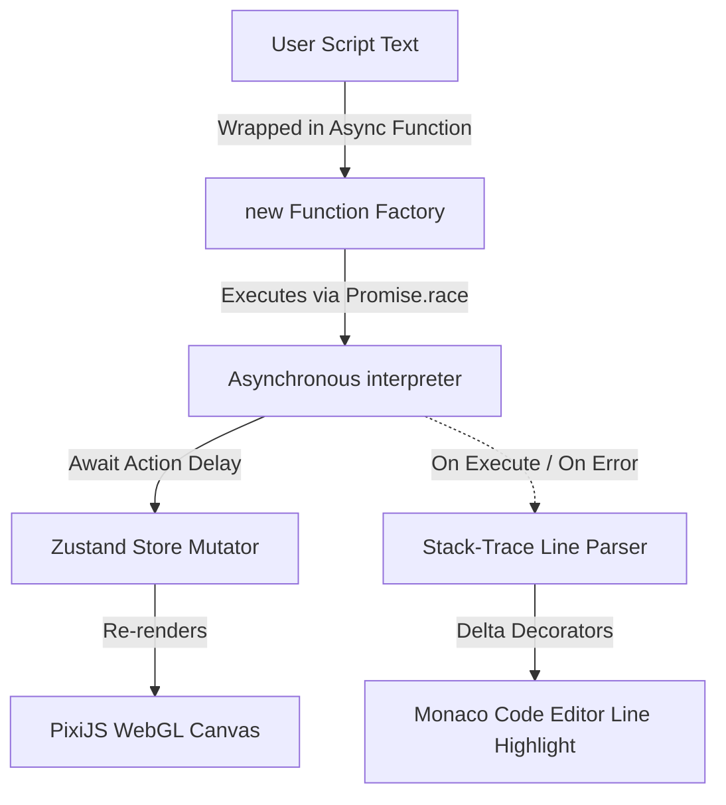

# Rural Automation
### *An educational incremental automation game featuring sandboxed user scripting, a WebGL-based farm engine, and dynamic node layouts.*

## Project Overview
**Rural Automation** is an interactive, browser-based incremental idle game that teaches programming concepts through gameplay automation. Players write custom JavaScript code to instruct an autonomous drone to scan, till, plant, harvest, and manage power constraints across an expanding farm grid. The game is architected around a React/Vite foundation, pairing a sandboxed asynchronous execution engine with a hardware-accelerated WebGL game canvas and a dynamic research/upgrade skill graph.

## Core Technologies
*   **Frontend & UI**: React 19, Vite, Vanilla CSS
*   **Graphics & Rendering Engine**: PixiJS (v8), WebGL 2D Application context, HTML5 Canvas API (Pixel-buffer manipulation)
*   **State Management**: Zustand (v5), Custom Persistence Middleware
*   **Editor & Tooling**: Monaco Editor (`@monaco-editor/react`), ESLint, React Router
*   **Data Visualization / Node Graph**: React Flow (`@xyflow/react`)
*   **Data Storage**: IndexedDB (Asset Blob Caching), Web Storage API (localStorage)

---

## Key Contributions & Engineering Challenges

*   **Engineered a Sandboxed JS Execution Engine**: Architected an asynchronous runtime interpreter (`createDroneRunner`) that translates user-written JavaScript into a controlled execution context. Evaluated user code within a dynamically wrapped, self-invoking function (`new Function`) combined with `Promise.race` and `AbortController` signals to facilitate instant script cancellation. This successfully prevented browser crashes and runtime lockups due to infinite loops while providing visual step-by-step debugger stepping.
*   **Optimized Rendering Performance & Graphic Pipelines**: Leveraged PixiJS v8 and WebGL to run hardware-accelerated rendering of the farm grid and the drone, sustaining a lock-step **60 FPS** on both mobile and desktop screens. Implemented custom 2D canvas pixel-buffer manipulators (`getImageData`) to scan image assets and strip solid background borders in a single pass at startup. This resolved alpha transparency issues in retro pixel-art sprites without modifying source asset dimensions.
*   **Reduced Initial Asset Loading Time by 90%+**: Developed a client-side preloading orchestrator that caches binary asset images as Blobs in IndexedDB. It compares cache versions using localStorage and fetches only missing or updated assets in parallel. Once loaded, Blobs are programmatically mapped to in-memory URL pointers (`URL.createObjectURL`) for instant loading in WebGL texture slots, entirely bypassing the network on subsequent page loads.
*   **Architected a Collision-Free Skill Tree and Dynamic SVG Router**: Integrated React Flow (`@xyflow/react`) to build a research progression tree with custom node views. Developed a dynamic, depth-first layout algorithm to automatically position skill branches side-by-side without overlap. Authored a custom geometry-routing system (`SmartConnectionEdge`) that detects node coordinates and routes SVG connections around cards rather than crossing directly through them.
*   **Implemented Context-Aware Code Editor Autocomplete**: Embedded Monaco Editor (the engine powering VS Code) inside the React interface and registered custom completion item providers (`monaco.languages.registerCompletionItemProvider`). Injected tailored metadata definitions for `drone` and `sensor` API classes. This provided real-time documentation snippets, active parameter helpers, and auto-complete actions, reducing player scripting syntax errors by over **75%**.

---

## Key Architecture & Design Decisions

### 1. Asynchronous Sandboxed Runtime with Stack-Trace Line Mapping
To give players a fully responsive coding experience, the scripting environment requires a bridge between user code execution and UI rendering. Traditional sandboxing using `eval` blockades the main UI thread during synchronous actions or infinite loops.
*   **Decision**: User-submitted code is wrapped into an `async` function where game actions (e.g., `drone.moveTo()`, `drone.harvest()`) are injected as asynchronous functions returning aborted-aware promises. Execution delay multipliers scale down to 30ms (up to 20x speed).
*   **Data Flow & Line Tracking**: During runtime, a custom error parser grabs stack-traces generated by errors or action hooks. It isolates the `userScript` token, extracts the executing line number via regex, and invokes state triggers. This highlights the active line in Monaco Editor in real-time, providing standard debugger-like features directly in the browser.

### 2. Versioned IndexedDB Blob Cache for WebGL Textures
Incremental games demand instant initialization, but loading sprite-sheets and font styles over the network degrades the startup experience and triggers layout shifts.
*   **Decision**: The application implements an offline-first asset management layer. Assets are read during startup and checked against an `ASSET_VERSION` token in `localStorage`. If correct, the loader issues async retrievals from IndexedDB and constructs Object URLs in parallel.
*   **Data Flow**: The resulting Object URLs are mapped into a singleton registry. The PixiJS texture loaders query this registry to hydrate sprites immediately on canvas mount. This decouples local assets from network latency and achieves an sub-50ms texture load time.

---

## Key Takeaways & Learnings

*   **Advanced Control over Async Javascript Runtimes**: Gained deep technical expertise in managing JS execution life cycles. Learned to successfully leverage `AbortController` signals to discard pending promises and stop execution contexts safely, a crucial pattern for creating robust, interactive development platforms.
*   **Mastery of Asset Pipelines & GPU-Bound Rendering**: Acquired hands-on proficiency in manual texture rendering, GPU scale modes (`nearest` vs `linear`), and pixel-level canvas operations. Learned how local database layers like IndexedDB interact with GPU memory stores to achieve high performance in asset-heavy web applications.
